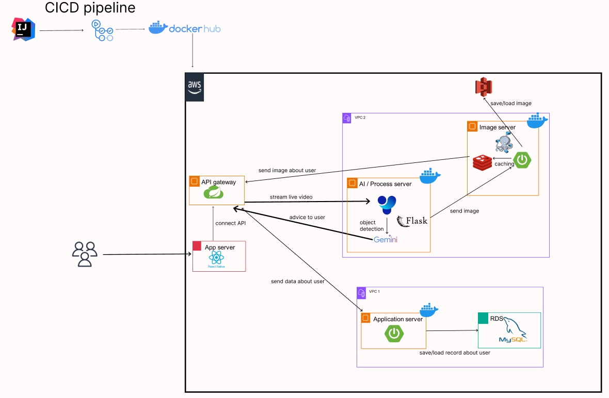

# MyParrot

### Development Period
2025-03-26 ~ 2025-05-16

### Problem Statement
Traditional assistive tools for the visually impaired, such as white canes or guide dogs, help ensure safe navigation but do not provide precise information about what lies ahead.  
Due to this limitation, visually impaired individuals often experience fear of the unknown, which leads to lower levels of physical activity compared to sighted individuals. This, in turn, increases the risk of health-related issues as a secondary problem.  

To address this issue, we decided to develop software that uses AI to analyze the surroundings and inform the user about what is ahead. By alleviating the fear of the unknown, this solution aims to increase mobility and promote a healthier lifestyle for visually impaired individuals.

### presentation

### System Architecture
